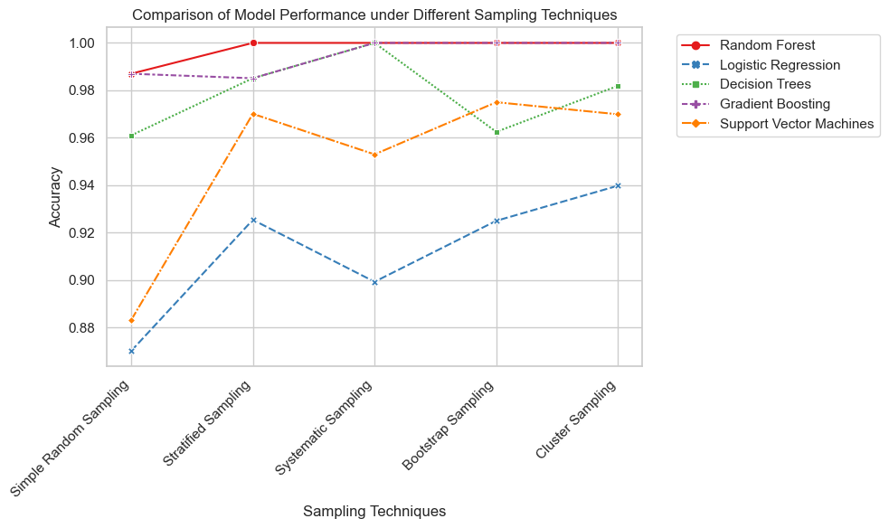
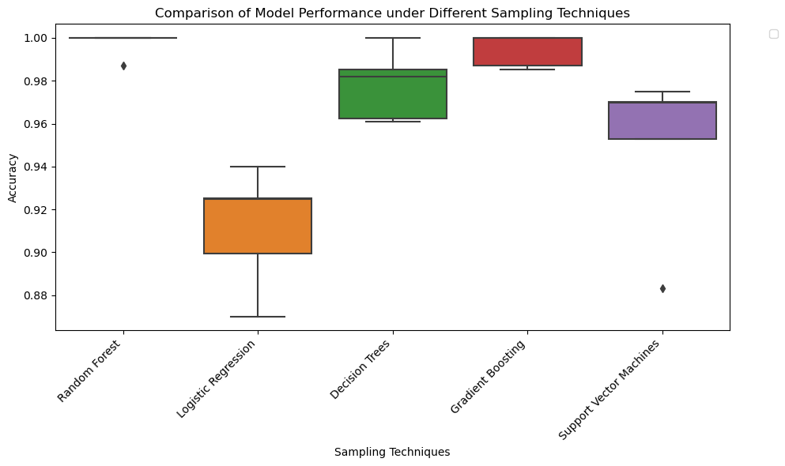

# Exploring Sampling Techniques in Machine Learning

This study delves into the influence of various sampling methods on machine learning model performance. Sampling techniques are pivotal for addressing imbalanced datasets and ensuring model robustness. The research investigates five common sampling strategies and assesses their impacts on the efficacy of five widely used machine learning algorithms.

## Introduction

Sampling techniques are indispensable in machine learning for handling diverse dataset characteristics such as imbalances and skewed distributions. This study aims to juxtapose the performance of machine learning models across different sampling methodologies.

## Sampling Techniques

### 1. Simple Random Sampling

Simple random sampling entails the random selection of data points without specific criteria. It serves as a fundamental and frequently employed sampling approach.

### 2. Stratified Sampling

Stratified sampling maintains class proportions in the sample consistent with those in the entire dataset, particularly beneficial for imbalanced datasets.

### 3. Systematic Sampling

Systematic sampling involves selecting every k-th element from the dataset after a random start, providing a representative sample through a deterministic approach.

### 4. Bootstrap Sampling

Bootstrap sampling entails repetitive sampling with replacement from the dataset, often utilized for statistical distribution estimation.

### 5. Cluster Sampling

Cluster sampling partitions the dataset into clusters and randomly selects entire clusters to form the sample, advantageous for datasets with inherent grouping.

## Machine Learning Models

### 1. Random Forest

A versatile ensemble learning technique constructing multiple decision trees during training and outputting the mode of classes for classification.

### 2. Logistic Regression

A linear model predicting the probability of a sample belonging to a class in binary and multiclass classification.

### 3. Decision Trees

A non-linear model recursively splitting data based on features, creating a tree-like structure for classification and regression tasks.

### 4. Gradient Boosting

An ensemble learning method building a sequence of weak learners, usually decision trees, and combining them to create a strong learner.

### 5. Support Vector Machines

A potent classification algorithm finding the hyperplane that best separates data into different classes.

## Results and Analysis

The table below displays the accuracy of each model under different sampling techniques:

| Model                   | Simple Random Sampling | Stratified Sampling | Systematic Sampling | Bootstrap Sampling | Cluster Sampling |
|-------------------------|------------------------|---------------------|----------------------|---------------------|-------------------|
| Random Forest           | 0.9870                 | 1.0000              | 1.000                | 1.000               | 1.000             |
| Logistic Regression     | 0.8701                 | 0.9254              | 0.8993               | 0.9250              | 0.9398            |
| Decision Trees          | 0.9610                 | 0.9851              | 1.000                | 0.9625              | 0.9819            |
| Gradient Boosting       | 0.9870                 | 0.9851              | 1.000                | 1.000               | 1.000             |
| Support Vector Machines | 0.8831                 | 0.9701              | 0.9530               | 0.9750              | 0.9699            |

### Line plot:

### Box plot:

## Conclusion

- Random Forest: All sampling techniques except Stratified Sampling yield identical accuracies.
- Logistic Regression: Systematic Sampling yields the highest accuracy.
- Decision Trees: Both Stratified Sampling and Bootstrap Sampling result in the highest accuracy.
- Gradient Boosting: All sampling techniques except Simple Random Sampling yield the same accuracy.
- Support Vector Machines: All sampling techniques except Simple Random Sampling result in the same accuracy, with Bootstrap Sampling achieving the highest.